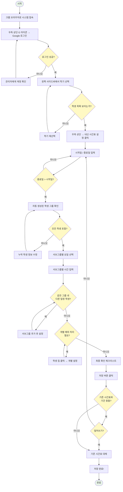

# 내신 시간표 순서도 - Excalidraw AI 프롬프트

Excalidraw (excalidraw.com) 에서 AI 기능을 사용하여 순서도를 자동 생성하려면
아래 프롬프트를 복사하여 Excalidraw AI에 붙여넣으세요.

---

## 사용법

1. **excalidraw.com** 에 접속합니다.
2. 왼쪽 도구 모음에서 **AI 아이콘** (또는 상단 메뉴의 AI 버튼)을 클릭합니다.
3. 아래 프롬프트를 **그대로 복사**하여 붙여넣습니다.
4. **Generate** 버튼을 클릭하면 순서도가 자동으로 생성됩니다.

---

## 프롬프트 (아래 전체를 복사하세요)

```
Create a vertical flowchart in Korean for "내신 시간표 작성 절차" (Exam Timetable Creation Process).

Use these node types:
- Rounded rectangles for steps
- Diamonds for decisions
- A stadium/pill shape for start and end

Use arrows to connect each step. Use a clean, professional style with light blue (#E3F2FD) fill for steps, light yellow (#FFF9C4) for decisions, and light green (#E8F5E9) for start/end.

Here is the flow:

START: "시작"

STEP 1: "크롬 브라우저에서 시스템 접속"

STEP 2: "우측 상단 G 아이콘 클릭 → Google 로그인"

DECISION 1: "로그인 성공?"
  - NO → "승인된 계정인지 관리자에게 확인" → back to STEP 2
  - YES → continue

STEP 3: "왼쪽 사이드바에서 현재 학기 선택"

DECISION 2: "학생 목록이 보이는가?"
  - NO → "학기 선택 확인 / '전체 학기' 선택" → back to STEP 3
  - YES → continue

STEP 4: "우측 상단 메뉴에서 '내신 시간표 설정' 클릭"

STEP 5: "내신 기간 설정\n- 시작일 입력 (달력에서 선택)\n- 종료일 입력 (달력에서 선택)"

DECISION 3: "종료일 > 시작일?"
  - NO → "날짜를 다시 설정" → back to STEP 5
  - YES → continue

STEP 6: "자동 생성된 학생 그룹 확인\n(학교 + 학부 + 학년 기준)\n중등/고등, 재원/등원예정만 표시"

DECISION 4: "모든 학생이 포함되어 있는가?"
  - NO → "누락 학생의 상태/학부 정보 확인 후 수정" → back to STEP 6
  - YES → continue

STEP 7: "서브그룹별 요일 선택\n(월~토 체크박스 클릭)"

STEP 8: "서브그룹별 시간 입력\n(24시간 형식, 예: 16:00)"

DECISION 5: "같은 그룹 내 다른 요일/시간 학생이 있는가?"
  - YES → "서브그룹 추가 버튼 클릭 → 새 서브그룹에 요일/시간 설정" → back to DECISION 5
  - NO → continue

DECISION 6: "개별 학생 중 예외 처리가 필요한가?"
  - YES → "학생 이름 칩 클릭 → 팝업에서 개별 요일/시간 설정" → back to DECISION 6
  - NO → continue

STEP 9: "최종 확인 체크리스트\n✓ 기간(시작일/종료일)\n✓ 모든 그룹 포함 여부\n✓ 요일/시간 설정\n✓ 예외 처리 완료"

STEP 10: "저장 버튼 클릭"

DECISION 7: "기존 내신 시간표와 기간 충돌?"
  - YES → DECISION 8: "덮어쓰기 하시겠습니까?"
    - YES → "기존 시간표를 새 시간표로 대체"→ continue
    - NO → "돌아가서 기간 수정" → back to STEP 5
  - NO → continue

STEP 11: "저장 완료!\n- 학생 상세에서 내신 수업 확인 가능\n- 내신 기간 중 정규 수업 자동 숨김\n- 내신 종료 후 정규 수업 자동 복귀"

END: "완료"

Make the flowchart clean, easy to read, with adequate spacing between nodes. Add a title at the top: "내신 시간표 작성 순서도". The overall layout should flow from top to bottom.
```

---

## 간단 버전 프롬프트 (축약형)

순서도가 너무 복잡하게 나올 경우 아래 간단 버전을 사용하세요.

```
Create a simple vertical flowchart in Korean titled "내신 시간표 작성 순서도".

Steps (top to bottom, use rounded rectangles with light blue fill):
1. 시스템 접속 & 로그인
2. 학기 선택
3. 내신 시간표 설정 열기
4. 기간 설정 (시작일 / 종료일)
5. 학생 그룹 확인 (자동 생성됨)
6. 서브그룹별 요일 선택 (월~토)
7. 서브그룹별 시간 입력 (24시간 형식)
8. (필요시) 서브그룹 추가
9. (필요시) 개별 학생 예외 처리
10. 최종 확인
11. 저장

Add two diamond decision nodes:
- After step 5: "학생 누락?" → YES: "학생 정보 수정" (loops back) / NO: continue
- After step 10: "기간 충돌?" → YES: "덮어쓰기 또는 기간 수정" / NO: continue

Use arrows between all steps. Clean professional style.
```

---

## Mermaid 다이어그램 (대안)

Excalidraw AI가 안 될 경우, 아래 Mermaid 코드를 mermaid.live 등에서 사용할 수 있습니다.


