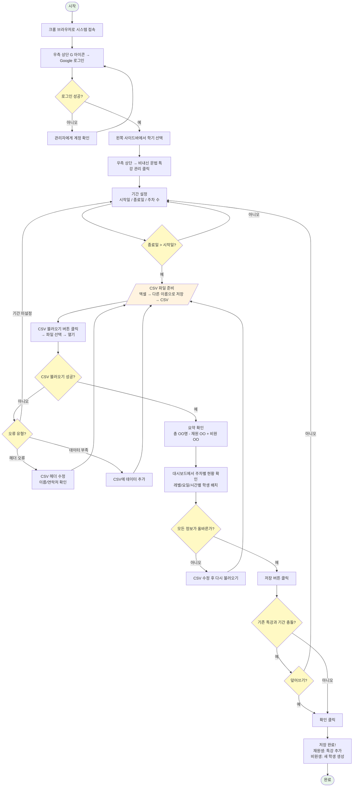

# 문법 특강 관리 순서도 - Excalidraw AI 프롬프트

Excalidraw (excalidraw.com) 에서 AI 기능을 사용하여 순서도를 자동 생성하려면
아래 프롬프트를 복사하여 Excalidraw AI에 붙여넣으세요.

---

## 사용법

1. **excalidraw.com** 에 접속합니다.
2. 왼쪽 도구 모음에서 **AI 아이콘** (또는 상단 메뉴의 AI 버튼)을 클릭합니다.
3. 아래 프롬프트를 **그대로 복사**하여 붙여넣습니다.
4. **Generate** 버튼을 클릭하면 순서도가 자동으로 생성됩니다.

---

## 프롬프트 (아래 전체를 복사하세요)

```
Create a vertical flowchart in Korean for "문법 특강 관리 절차" (Grammar Special Class Management Process).

Use these node types:
- Rounded rectangles for steps
- Diamonds for decisions
- Parallelograms for input/output
- A stadium/pill shape for start and end

Use arrows to connect each step. Use a clean, professional style with light blue (#E3F2FD) fill for steps, light yellow (#FFF9C4) for decisions, light orange (#FFF3E0) for input/output, and light green (#E8F5E9) for start/end.

Here is the flow:

START: "시작"

STEP 1: "크롬 브라우저에서 시스템 접속"

STEP 2: "우측 상단 G 아이콘 클릭 → Google 로그인"

DECISION 1: "로그인 성공?"
  - NO → "승인된 계정인지 관리자에게 확인" → back to STEP 2
  - YES → continue

STEP 3: "왼쪽 사이드바에서 현재 학기 선택"

STEP 4: "우측 상단 메뉴 → '비내신 문법 특강 관리' 클릭"

STEP 5: "기간 설정\n- 시작일 (달력에서 선택)\n- 종료일 (달력에서 선택)\n- 주차 수 입력 (기본값: 3)"

DECISION 2: "종료일 > 시작일?"
  - NO → "날짜를 다시 설정" → back to STEP 5
  - YES → continue

INPUT 1: "CSV 파일 준비\n(엑셀에서 저장: 파일→다른 이름으로 저장→CSV)\n필수 열: 이름, 연락처, 1주차~N주차\n주차 형식: 레벨/요일/시간 (예: HA/월/16:00)"

STEP 6: "'CSV 불러오기' 버튼 클릭 → 파일 선택 → 열기"

DECISION 3: "CSV 불러오기 성공?"
  - NO → DECISION 3-1: "어떤 오류?"
    - "기간 미설정" → back to STEP 5
    - "컬럼 못 찾음" → "CSV 헤더 수정 (이름/연락처 확인)" → back to INPUT 1
    - "데이터 부족" → "CSV에 2줄 이상 데이터 추가" → back to INPUT 1
  - YES → continue

OUTPUT 1: "요약 표시: '총 OO명 (재원 OO + 비원 OO)'"

STEP 7: "대시보드에서 주차별 현황 확인\n- 주차별 레벨/요일/시간 카드\n- 학생 칩: 진한색=재원, 연한색=비원"

DECISION 4: "모든 정보가 올바른가?"
  - NO → "CSV 수정 후 다시 불러오기" → back to INPUT 1
  - YES → continue

STEP 8: "'저장' 버튼 클릭"

DECISION 5: "기존 특강과 기간 충돌?"
  - YES → DECISION 6: "덮어쓰기 하시겠습니까?"
    - YES → continue
    - NO → "CSV 또는 기간 수정" → back to STEP 5
  - NO → continue

STEP 9: "확인 대화상자\n'OO명 문법 특강을 저장합니다'\n→ '확인' 클릭"

STEP 10: "저장 완료!\n- 재원생: 기존 학생에 특강 추가\n- 비원생: 새 학생 자동 생성\n- 수업종류: 특강 / 레벨: GR / 반: 901"

END: "완료"

Make the flowchart clean, easy to read, with adequate spacing between nodes. Add a title at the top: "문법 특강 관리 순서도". The overall layout should flow from top to bottom.
```

---

## 간단 버전 프롬프트 (축약형)

순서도가 너무 복잡하게 나올 경우 아래 간단 버전을 사용하세요.

```
Create a simple vertical flowchart in Korean titled "문법 특강 관리 순서도".

Steps (top to bottom, use rounded rectangles with light blue fill):
1. 시스템 접속 & 로그인
2. 학기 선택
3. 문법 특강 관리 열기
4. 기간 설정 (시작일 / 종료일 / 주차 수)
5. CSV 파일 준비 (엑셀 → CSV 저장)
6. CSV 불러오기
7. 대시보드에서 주차별 현황 확인
8. 저장

Add three diamond decision nodes:
- After step 4: "종료일 > 시작일?" → NO: "날짜 재설정" (loops back) / YES: continue
- After step 6: "CSV 불러오기 성공?" → NO: "CSV 수정 후 재시도" (loops back) / YES: continue
- After step 7: "정보가 올바른가?" → NO: "CSV 수정 후 재불러오기" (loops back) / YES: continue

Add a note box on the right side of step 5:
"CSV 주차 형식: 레벨/요일/시간
예: HA/월/16:00"

Use arrows between all steps. Clean professional style.
```

---

## Mermaid 다이어그램 (대안)

Excalidraw AI가 안 될 경우, 아래 Mermaid 코드를 mermaid.live 등에서 사용할 수 있습니다.


